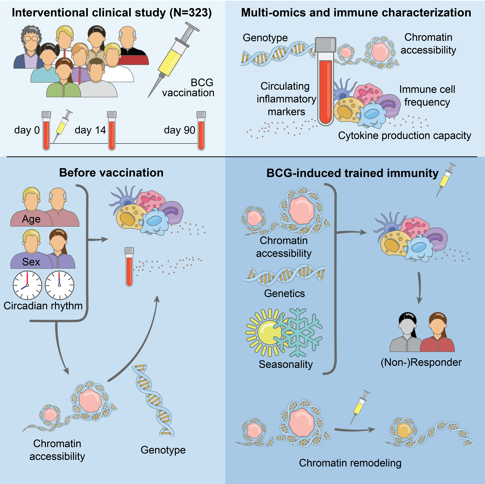

# 300BCG analysis

This repository contains scripts to re-create the results and basic figures from the manuscript
entitled **"Multi-omics analysis of innate and adaptive responses to BCG vaccination reveals epigenetic cell states that predict trained immunity"** by Moorlag, Folkman, ter Horst, Krausgruber et al., *Immunity* (2024). doi: https://doi.org/10.1016/j.immuni.2023.12.005

The analyses for this paper were performed by Rob ter Horst ([src_rob](./src_rob/)) and Lukas Folkman ([src_lukas](./src_lukas/)). Details regarding the specific analyses are provided in each subfolder. This repository does not contain [ATAC-seq raw data processing](https://github.com/epigen/300BCG_ATACseq_pipeline) and genetics raw data processing.

**Paper:** [Multi-omics analysis of innate and adaptive responses to BCG vaccination reveals epigenetic cell states that predict trained immunity](http://300bcg.bocklab.org/)

**How to cite?** Moorlag, Folkman, ter Horst, Krausgruber et al., 2024, *Immunity* 57, 1–17, doi: https://doi.org/10.1016/j.immuni.2023.12.005

**Website:** [300BCG.bocklab.org](http://300BCG.bocklab.org/)

**Data availability:**

- [ATAC-seq counts (GEO)](https://www.ncbi.nlm.nih.gov/geo/query/acc.cgi?acc=GSE241092)
- [raw ATAC-seq data (EGA)](https://ega-archive.org/studies/EGAS50000000090)
- [personal immune profiles (Zenodo)](https://doi.org/10.5281/zenodo.10288920)
- [metadata (GitHub)](./metadata/)

**Graphical abstract:**

**Manuscript abstract:**

Immune responses are tightly regulated, yet highly variable between individuals. To investigate human population variation of trained immunity, we immunized healthy individuals with Bacillus Calmette-Guérin (BCG). This live-attenuated vaccine induces not only an adaptive immune response against tuberculosis, but also triggers innate immune activation and memory that is indicative of trained immunity. We established personal immune profiles and chromatin accessibility maps over a 90-day time course of BCG vaccination in 323 individuals. Our analysis uncovered genetic and epigenetic predictors of baseline immunity and immune response. BCG vaccination enhanced the innate immune response specifically in individuals with a dormant immune state at baseline, rather than providing a general boost of innate immunity. This study advances our understanding of BCG’s heterologous immune-stimulatory effects and of trained immunity in humans, and it highlights the value of epigenetic cell states for connecting immune function with genotype and the environment.
